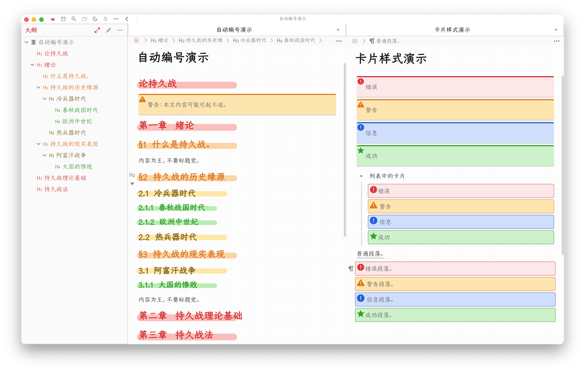

# 思源主题：Yang Light

本主题以 [Zhang Light 主题](https://github.com/UserZYF/zhang-light) 为模板进行定
制。主要的定制包括：

1. 新增了对四种卡片的特殊设置（灵感来源于 Tsundoku Light）
2. 重构了标题自动编号: 章编号从第二个H1开始，第一个H1作为文档标题
3. 移除了文档树的渐变背景

## 🙏 感谢列表

- 感谢 Zhang Light 的作者和贡献者 https://github.com/UserZYF/zhang-light

## 📌 注意事项

- 解压主题文件夹后，从下面网址下载仓耳今楷03-W03字体，并安装到系统中：
  - http://www.tsanger.cn/product/37
- 安装字体并切换主题后，将「设置-编辑器-字体」设置为「仓耳今楷03」。如果不设置，
  输出为 PDF 的时候字体会使用系统默认，而非主题指定的仓耳字体。
- 系统上请勿安装「仓耳今楷03」系列的 W01 和 W02 字体，否则编辑器将自动选择 W01
   或 W03，效果变差。

## 🎉 更新进度

### 0.1

初始发布。
